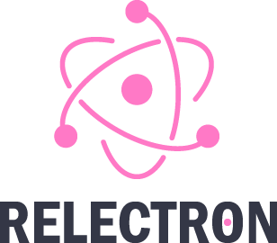

<p align="center">
  
</p>

<h3 align="center">
  Electron boilerplate application with ReactJs!
</h3>

<br>

## Installation

Install all dependencies

```bash
npm install
```

or 

```bash
yarn install
```

## Usage
To run the project in development mode type the commands below

```bash
npm run dev
```

or

```bash
yarn dev
```
## Build the pack
To generate a project package run `package`

```bash
npm run package
```

or

```bash
yarn package
```
